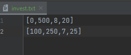

# Investment Calculator

The investment calculator calculates projected sums based on current account balance, monthly investment, rate of return, and the length of the investment.

Communication Contract for Microservice use:

Send Request
* investmentCalc.py reads input from a text file, invest.txt
  * Input format [Current account balance, Monthly Contribution, Expected Rate of Return, Time to Maturity]
  * The input accepts two separate lists on individual lines

Receive Output
* The program will calculate and print the result to invest.txt

